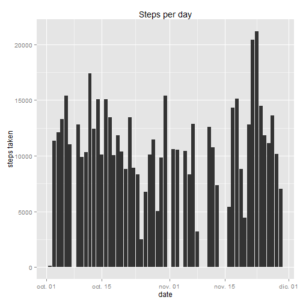
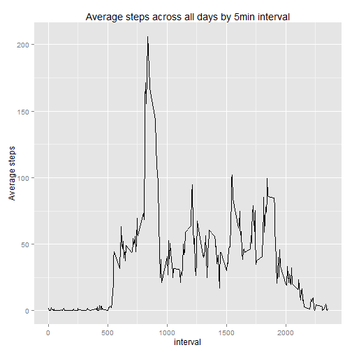
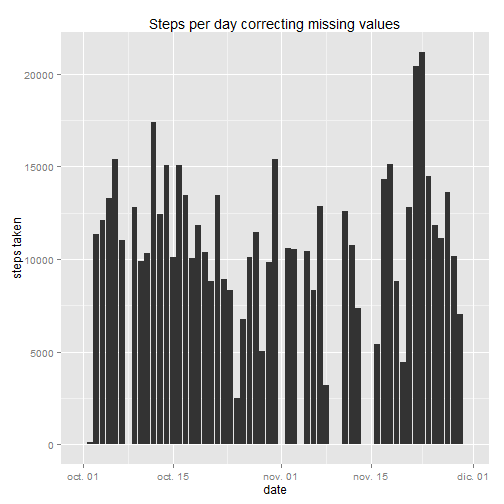
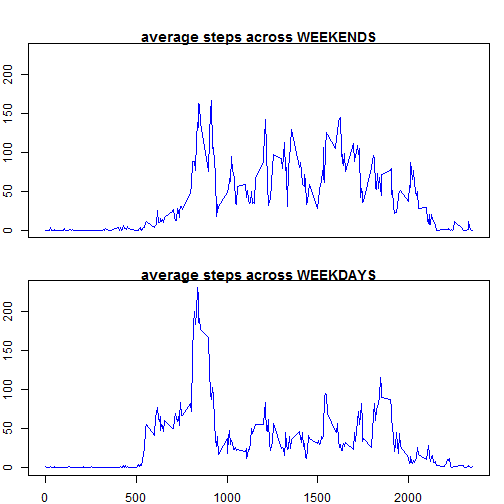

#Loading and prepocessing the data
==================================
First we have downloaded the data from [here](https://github.com/mray0n/RepData_PeerAssessment1/blob/master/activity.zip). After that we load the data and check what it is like:


```r
file<-read.csv("activity.csv",header=T)
head(file)
```

```
##   steps       date interval
## 1    NA 2012-10-01        0
## 2    NA 2012-10-01        5
## 3    NA 2012-10-01       10
## 4    NA 2012-10-01       15
## 5    NA 2012-10-01       20
## 6    NA 2012-10-01       25
```

We can see we have a date column. We are converting this into a time class series


```r
file$date<-as.Date(file$date,"%Y-%m-%d")
```

#What is mean total number of steps taken per day
=================================================

To calculate the total number of steps per day we will use the dplyr package


```r
library("dplyr")
Stepsperday<- file %>%
  group_by(date)%>%
  summarise(total=sum(steps))
```
To plot the total steps taken per day we will use ggplot2 packages, for the dataframe obtained just above

```r
library(ggplot2)
a<-ggplot(Stepsperday,aes(date,total))
a+geom_bar(stat="identity")+labs(title="Steps per day", y="steps taken")
```

```
## Warning: Removed 8 rows containing missing values (position_stack).
```

 
And finally, using again dplyr we will calculate the mean and the median:


```r
summarise(Stepsperday, mean=mean(total, na.rm=TRUE),
          median=median(total,na.rm=TRUE))
```

```
## Source: local data frame [1 x 2]
## 
##       mean median
##      (dbl)  (int)
## 1 10766.19  10765
```

#What is the average daily activity Pattern
===========================================
## Make time series

In order to build the data frame tha we will use to make the plot, we use again the dplyr package
In order to build the data frame, NA's will be ignored; i.e. the mean will not take them into account


```r
Avgperinterval<- file%>%
  group_by(interval)%>%
  summarise(avg=mean(steps,na.rm=TRUE))
b<- ggplot(Avgperinterval, aes(interval,avg))
b+geom_line()+labs(title="Average steps across all days by 5min interval", 
                   y="Average steps")
```

 
##Which 5 minute interval contains the maximum number of steps?
To calculate this, lets rearrange the data set used for the time series plot. We will order the time intervals per descendant order of the steps taken, and then display the first 5 lines of the matrix

```r
z<- arrange(Avgperinterval,desc(avg))
maxsteps<-z[1,1]
head(z)
```

```
## Source: local data frame [6 x 2]
## 
##   interval      avg
##      (int)    (dbl)
## 1      835 206.1698
## 2      840 195.9245
## 3      850 183.3962
## 4      845 179.5660
## 5      830 177.3019
## 6      820 171.1509
```
We can see it is the interval 835 minute that gets the maximum number of steps

#Imputing missing values
========================
1. To calculate the number of missing values, we use

```r
na<-is.na(file$steps)
sum(na)
```

```
## [1] 2304
```

```r
nanumber<-sum(na)
```
So the total number of missig values is 2304

2. To input the NA values we are going to use the mean values calculated in the average daily activity pattern
3. We will build a large dataframe with the original data, the daily average of the interval, the na vector of steps and the NotNA vector of steps. We will also substitute the NA values with 0, and then add the number of the average steps for that interval, only where the original step value was NA
(it si simpler to do it than it is to describe it)


```r
nona<-!is.na(file$steps) ## create also a vector of not na steps
file2<-cbind(file,Avgperinterval$avg,na,nona) ## create the enlarge DF
file2$steps[is.na(file2$steps)]<-0 ## substitute the NA's with 0
file2<-mutate(file2,
              steps2=(steps+       ## We will add a column steps2 to add to steps
                        (Avgperinterval$avg*na))) ## the average only where we had ## NA
```

4. To make the histogram we will use exactly the same procedure than the initial histogram created before

```r
## first create teh arrangement of data
Stepsperday2<- file2 %>%
  group_by(date)%>%
  summarise(total=sum(steps))
## then build the plot
a2<-ggplot(Stepsperday2,aes(date,total))
a2+geom_bar(stat="identity")+
  labs(title="Steps per day correcting missing values", y="steps taken")
```

 
With the correction of missing values, we have And finally, the mean and the median:

```r
summarise(Stepsperday2, mean=mean(total, na.rm=TRUE),
          median=median(total,na.rm=TRUE))
```

```
## Source: local data frame [1 x 2]
## 
##      mean median
##     (dbl)  (dbl)
## 1 9354.23  10395
```
Comparing with the original data, the differences are very low. The histograms are very similar. The mean is 10% lower now and the  median is 4% lower, due to the fact that before we had less elements with higher values and now we have more elements (we have added 2304 that previously were NA's) with average values.

#Are there difference in activity patterns between weekdays and weekend?
========================================================================
So first we are taking the last DF, i.e. correcting the NA's, and we are assigning a new variable, the week day, with the function weekdays

After that, with dplyr package we are creating the data sets for weekends (name we) and for weekdays (name wd), and collapsing them to get the average per time interval


```r
file2<-mutate(file2,
              wd=weekdays(date)) ## create new variable with the week day
we<- file2 %>%
  filter(wd=="sábado"|wd=="domingo") %>%
  group_by(interval)%>%
  summarise(avgwe=mean(steps2))
## Sábado is Saturday and domingo is Sunday, original language in spanish
## data set for the average number of steps across weekends per interval
wd<- file2 %>%
  filter(wd=="lunes"|wd=="martes"|wd=="miércoles"|
           wd=="jueves"|wd=="viernes") %>%
  group_by(interval)%>%
  summarise(avgwd=mean(steps2))
## The same for the rest of days of the week
```

Finnally, plotting the average number of steps across wekends and weekdays, we get the following plot:

```r
ymax<-max(wd$avgwd,we$avgwe)
par(mfrow = c(2,1), mar = c(2, 2, 1, 1), oma = c(0, 0, 2, 0))
with (we, plot(avgwe~interval, type="l",col="blue",
               xlab="", ylab="steps", xaxt="n",
               ylim=c(0,ymax),
               main="average steps across WEEKENDS"))

with (wd, plot(avgwd~interval, type="l",col="blue",
               xlab="interval", ylab="steps",
               ylim=c(0,ymax),
               main="average steps across WEEKDAYS"))
```

 
